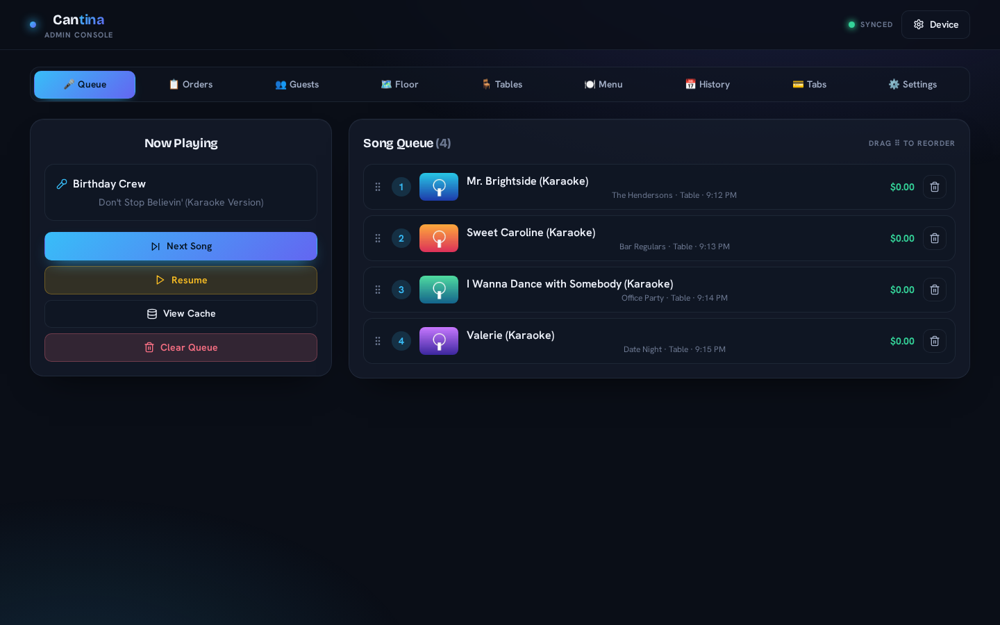
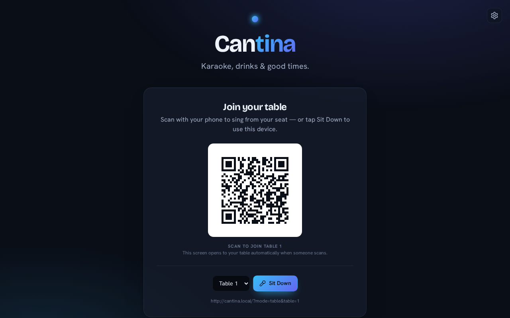
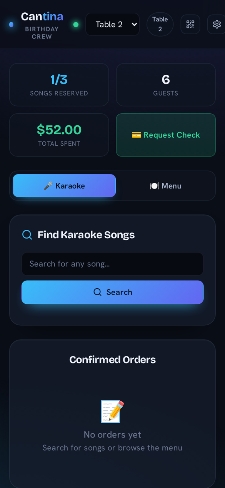
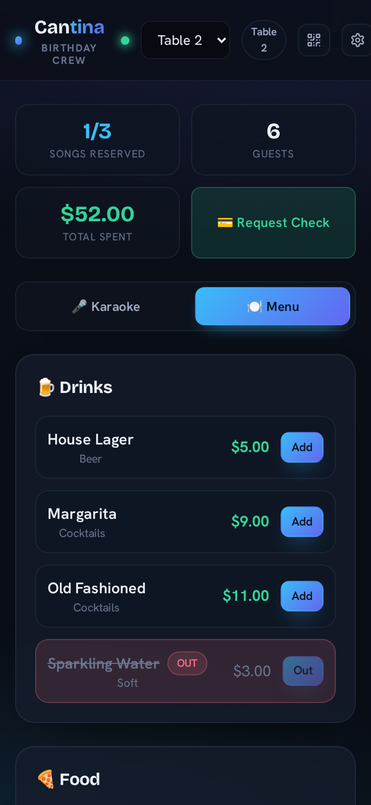
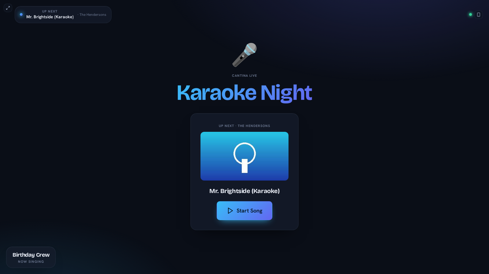
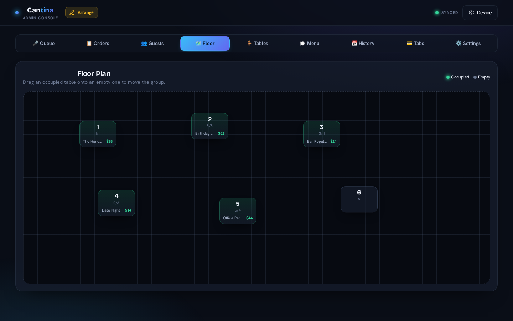
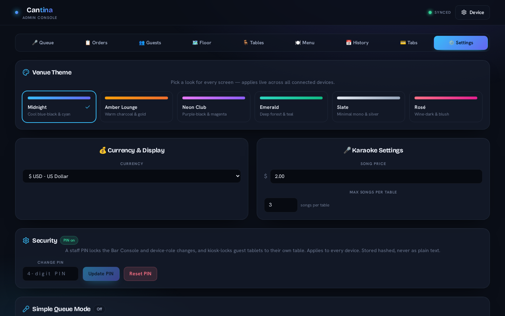

# Cantina

Karaoke night and bar service in one app. Guests scan a QR code at their table, search for a song, and order drinks from their phone. The TV shows who is up next. Staff run the queue, the floor and the tabs from a console.



*Screenshots use demo data.*

## Three screens, one venue

Every device picks a role. They all sync live over Socket.io, so a song added at table 2 shows up on the TV and in the bar console right away.

| | |
| --- | --- |
| **Table** (guest phone) | Search YouTube for karaoke tracks, queue songs against a per-table limit, order from the menu, request the check. |
| **TV** | Shows the song playing, who is up next, and a QR code so new tables can join. |
| **Bar console** (staff) | Queue, orders, guests, floor plan, table manager, menu, sales history, open tabs and settings. PIN-protected. |

| Join by QR | Table, on a phone | Table menu |
| :-- | :-- | :-- |
|  |  |  |





## Features

- **Live queue.** Drag to reorder, skip, or clear. Tables have a song limit so one group cannot hog the night.
- **Songs that always play.** When a video blocks embedding, Cantina downloads it once with `yt-dlp` and plays the local copy from then on. This part needs `yt-dlp` installed and is optional.
- **Floor plan.** Drag tables around, see which are occupied, and move a group to another table.
- **Tabs and checkout.** Per-table orders, split the bill between guests, check requests, and a sales and guest history by day or month.
- **Menu manager.** Drinks and food with prices and an in-stock toggle.
- **Themes.** Midnight, Amber Lounge, Neon Club, Emerald, Slate and Rosé, applied to every screen at once.
- **Simple Queue Mode.** Hides tables and billing for a plain "scan and sing" night.
- **Staff PIN.** Locks the console and keeps guest tablets on their own table.
- **State survives restarts.** The venue state is written to `server/state.json`, with a backup copy.



## Quick start

You need Node.js and a YouTube Data API v3 key. [YOUTUBE_API_SETUP.md](YOUTUBE_API_SETUP.md) walks through getting one.

```bash
git clone https://github.com/sh0tybumbati/Okibar.git
cd Okibar
npm install
cp .env.example .env     # then set YOUTUBE_API_KEY
npm run dev              # API on :5000, React dev server on :3000
```

Open `http://localhost:3000`. Pick a role on the landing screen, or deep-link one: `/?mode=tv`, `/?mode=bar`, `/?mode=table&table=3`. Without an API key, search falls back to songs the venue has already cached.

For a real night, build once and let the server serve everything:

```bash
npm run build
npm start                # http://<your-lan-ip>:5000
```

Phones on the same network can then scan the QR code on the TV.

## Desktop app

Cantina also ships as an Electron app, so the venue computer runs it without a terminal:

```bash
npm run electron:dev       # build and launch
npm run electron:build     # Linux AppImage and deb
npm run electron:build:win # Windows installer
```

## Scripts

| Script | What it does |
| --- | --- |
| `npm run dev` | Server and React dev server together |
| `npm run server` | Backend only, restarts on `.env` changes |
| `npm run client` | React dev server only |
| `npm run build` | Production build into `build/` |
| `npm start` | Serve the production build |
| `npm test` | Run the tests |

## Configuration

| Variable | Purpose |
| --- | --- |
| `PORT` | Server port. Default `5000`. |
| `YOUTUBE_API_KEY` | YouTube Data API v3 key for search. |
| `CANTINA_STATE_FILE` | Where venue state is saved. Default `server/state.json`. |
| `CANTINA_MEDIA_DIR` | Where archived videos are stored. Default `server/media`. |

## Built with

React, Tailwind CSS, Express, Socket.io, the YouTube Data API, and Electron for the desktop build.

## License

All rights reserved.
